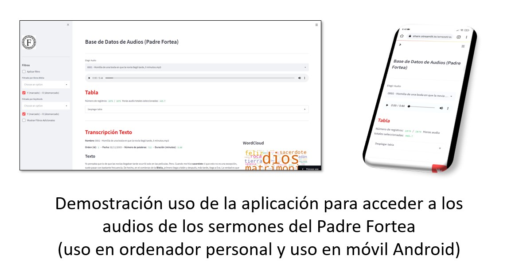
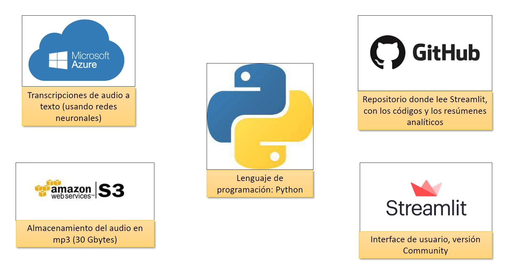

# Base de Datos de Audios Padre Fortea

https://share.streamlit.io/amezet/audios_fortea_app/main

Funcionalidades de la aplicación:
- **Recopilación de todos los audios** de sermones y conferencias en un solo lugar (1876 audios hasta la fecha)
- **Transcripción** de todos los audios para echar un vistazo rápido al contenido del mismo
- Analítica con búsqueda de **palabas clave y menciones de textos bíblicos**
- **Búsqueda avanzada (filtros)** de audios por palabras clave y/o textos bíblicos
- Imagen **“WordCloud”** para tener un primer vistazo rápido del contenido del audio con las palabras clave más usadas
- **Enriquecimiento del texto** mendiante destacado de las palabras clave (negrita) y de los textos bíblicos (negrita en rojo) en las transcripciones de los textos
- **Filtros** para hacer una selección de textos en función de:
  - Palabras clave
  - Textos bíblicos
  - Duración
  - Fechas
  - Orden (Identificador del audio)
- **Histogramas** de las selecciones de audios filtrados

Vídeo con demostración del uso de la aplicación (pinchar en la imagen para ir al vídeo en Youtube):

Principales herramientas utilizadas:

